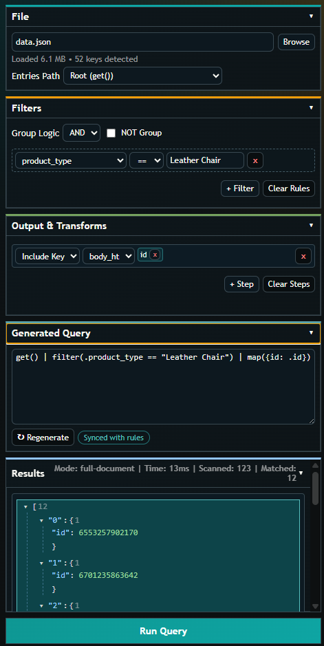

# JSON Filter Pro

JSON Filter Pro helps you filter and transform JSON files in VS Code without starting from a blank query.

You can build filters visually, run them fast, and edit the generated query when you need advanced control.



## What this extension does

- Adds an Explorer command for `.json` files: **Open JSON Filter Pro**
- Detects key paths from your JSON file
- Lets you build filter rules with operators like `==`, `>`, `in`, `regex`, `match`, and `exists`
- Generates a JSON Query expression automatically
- Lets you edit that query manually before running
- Shows results in an expandable tree view

## How it works (simple flow)

1. Right-click a `.json` file in Explorer.
2. Click **Open JSON Filter Pro**.
3. Choose an **Entries Path** (for example, `entries` if your items are under `entries[]`).
4. Add one or more rules.
5. Optional: add pipeline steps like `map`, `sort`, or `limit`.
6. Click **Run Query**.
7. Review the results and refine rules or query text.

## Example

If your JSON looks like this:

```json
{
  "page": 1,
  "entries": [
    { "id": 123, "name": "Alpha" },
    { "id": 456, "name": "Beta" }
  ]
}
```

Set **Entries Path** to `entries`, then add a rule like `id > 200`.
The result will return only the matching entry (`id: 456`).

## Large file support

JSON Filter Pro uses two execution modes:

- **Full-document mode** for smaller files
- **Stream-filter mode** for larger files

Stream-filter mode is optimized for root-array JSON patterns and helps keep VS Code responsive.
If a query is not stream-compatible, the extension shows guidance instead of freezing.

## Settings

- `jsonFilterPro.largeFileThresholdMb`: file size threshold for large-file mode
- `jsonFilterPro.previewResultLimit`: max result items sent to the UI

## Help with custom queries

- JSON Query docs: https://jsonquerylang.org/docs/
- JSON Query function reference: https://jsonquerylang.org/reference/

## Tips

- For keys with special characters, use quoted paths like `."salsify:id"`.
- Start with rules first, then hand-edit query text for advanced cases.
